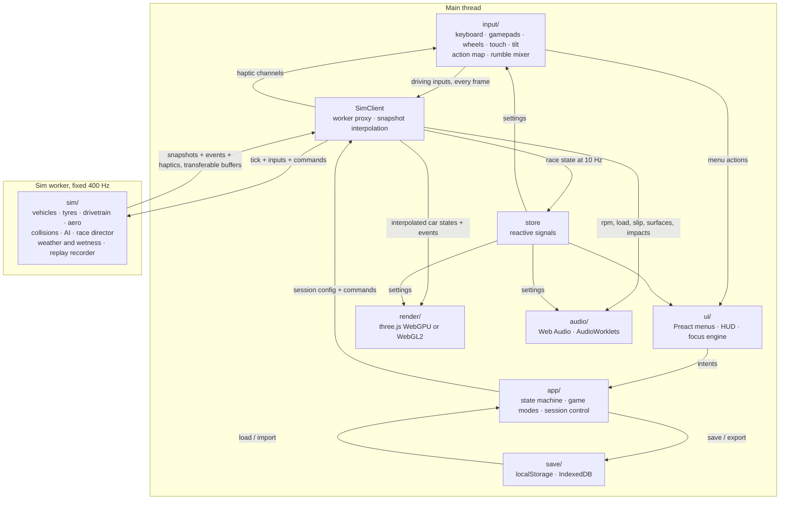
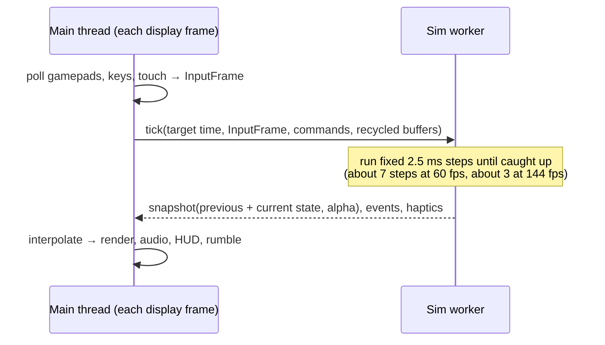

# APEX GRAND PRIX: Master Plan

> **Status:** Rounds 1–2 and Push 3 merged. **Change of approach (your call after Round 2):** no more small rounds with a checklist each; the game is now built toward a complete, publishable release in large pushes, following the vision in order of impact: menus, circuits, game modes and AI first, then more cars and circuits, liveries, weather, touch controls and the rest. See the progress log (§10).
> This plan changes as we go. I update it at the end of every round with status, decisions and what we learned.

**TL;DR**
- A browser racing game built with TypeScript, Vite and three.js. It renders with WebGPU and falls back to WebGL2 automatically. Physics runs in a Web Worker at 400 Hz. It installs as a PWA and is hosted on GitHub Pages.
- We build it in **24 small rounds**. Every round ends with a playable build at a public URL, automated checks, and a checklist for you to test on PC and iPad.
- The physics can be excellent. The visuals can be polished, but not "AAA art", because there are no artists and no licensed models. Some parts of the vision don't work in browsers as written: real-time ray tracing, rumble on iPad and steering-wheel force feedback. §2 explains each one and what we'll do instead.

---

## 0. Starting point

At the start of Round 0 the repository `ahmedps520-svg/apex-grand-prix` was **empty**: no commits, no branches, no files. `PLAN.md` was the first commit. Now:
- `main` holds the released game and deploys to GitHub Pages: `https://ahmedps520-svg.github.io/apex-grand-prix/`.
- Each round is built on `claude/eloquent-hypatia-2dn5u6` and merged into `main` through one pull request.

---

## 1. How we work

**The round loop** (agreed after Round 0)
1. **Start of round:** I post a short plan for the round (what I'll build and the acceptance checks), then build it without waiting. I apply your feedback from the last round first: bugs, then handling feel, then priorities.
2. I build only that round's scope and keep everything from earlier rounds working.
3. I open **one pull request per round** into `main`. CI runs the automated checks on it. Once they pass, I merge it myself, and `main` deploys to GitHub Pages automatically.
4. **End of round:** I post what works, what's broken or rough, the deployed link and the test checklist.
5. You test and reply with bugs before the next round. If a round turns out bigger than expected, I split it instead of cutting corners.

**Definition of done (every round)**
- All of the round's acceptance checks pass. Automated checks run in CI; you do the manual ones.
- The build is deployed and the browser console shows no errors.
- It works in Chrome/Edge on PC and Safari on iPad. Every new screen can be used with a controller alone.
- New settings have sensible defaults, are saved, and are included in save export and import.
- The standing checks below still pass.

**Standing checks.** These form a regression suite that grows over time.

| # | Check | From round |
|---|---|---|
| S1 | The game starts with no console errors: in headless Chromium in CI, and on your Chrome/Edge and iPad | 1 |
| S2 | Physics fuzz test: long runs with random inputs never produce NaN values or "explosions" | 1 |
| S3 | Every car's physics benchmark numbers stay inside its class targets (§5.4) | 2 |
| S4 | A simulated controller walks the whole menu tree: no dead ends, focus always visible, Back always works | 3 |
| S5 | Save files from every earlier round still load (a test save from each round is kept) | 3 |
| S6 | Entering and leaving a session 10 times returns memory use (JS heap and GPU resources) to its starting level | 4 |
| S7 | Benchmark results are no more than 5 % worse than the previous round | 11 |

**What I can and can't check myself.** I work in a cloud container with no real GPU, controller, wheel or iPad. I can check game logic and physics numbers, and I can render in headless Chromium: WebGL2 in software, and WebGPU too if its software adapter works there. I **can't** feel the handling or the rumble, and I can't measure frame rates on your devices. So your feedback is how we tune the game. Every round includes tools that make your reports precise: a performance overlay, telemetry, a controller tester, and from Round 11 a built-in benchmark whose results you can copy and paste to me.

---

## 2. Reality check: the vision vs. what browsers can do

| Vision item | Browser reality (September 2026) | What we'll do |
|---|---|---|
| WebGPU renderer with WebGL2 fallback | Chrome and Edge ship WebGPU on Windows and macOS. Safari has it from version 26, which includes iPadOS 26. iPads that can't run iPadOS 26 only have WebGL2. | three.js `WebGPURenderer` uses WebGPU when available and switches to its WebGL2 backend automatically. A setting can force WebGL2. |
| Real-time ray-traced reflections and AO via compute shaders | No browser API gives access to ray-tracing hardware. Ray tracing in compute shaders works, but it's far too slow for a 20-car scene at 60 fps on an iPad. | Screen-space reflections (SSR) and GTAO ambient occlusion, which work on both backends, plus reflection probes and cheaper tricks for wet roads. Real path tracing only in photo mode. |
| Path-traced photo mode | Possible as a progressive render that takes seconds to a minute per image. The mature library for this (three-gpu-pathtracer) only supports WebGL2. | Photo mode opens a separate WebGL2 canvas with a converted copy of the scene. Experimental, and planned for a late round. |
| Compute-shader effects | WebGPU only. | GPU particles and clustered lights (hundreds of lights, e.g. floodlights) on WebGPU. Simpler versions on WebGL2: particles computed on the CPU, lighting pre-computed. |
| 120+ fps on PC | Browsers never render faster than the display's refresh rate. There is no uncapped mode. | 120+ fps needs a 120 or 144 Hz monitor. We aim for the refresh rate, helped by dynamic resolution. |
| 60 fps on iPad | By default Safari caps animation at 60 fps, even on 120 Hz iPads, and at a lower rate in Low Power Mode. Safari reloads a tab that uses too much memory, often well under 2 GB. | 60 fps is the iPad target. Strict memory budget. A battery-saver mode. |
| Physics in a worker at 400 Hz | Works. But controller input can only be read on the main thread, so inputs arrive at display rate (60 to 144 times a second). Shared memory between threads (`SharedArrayBuffer`) requires server settings GitHub Pages doesn't allow. | The main thread reads input every frame and sends it to the worker, which smooths it across its 400 Hz steps. Results come back in buffers handed between threads without copying (transferable buffers), so shared memory isn't needed. |
| Controller rumble | Chrome and Edge support two-motor rumble on common Xbox and PlayStation pads (we confirm yours in Round 3). They also support trigger rumble on Xbox controllers under Windows (Chrome 126+). Safari on the Mac supports two-motor rumble. **Safari on iPad has no controller rumble.** No browser exposes DualSense adaptive triggers or HD haptics. | Rumble is used only where the browser supports it. On iPad, the setting explains that rumble isn't available. Rumble only adds to what's on screen and in the audio; you never need it to know what's happening. |
| Steering wheels and force feedback | Wheels show up as generic controllers with their own axis layouts. The browser controller API has **no force feedback**. Chrome/Edge on desktop can talk to some wheels directly over WebHID, but only with model-specific code. iPadOS supports almost no wheels. | A setup wizard and saved profiles for wheels on PC. Force feedback over WebHID is an experimental stretch goal for one wheel family. |
| Tilt steering | Works on iPad, but only after the player taps to allow motion access, and only over HTTPS. | A permission step and a calibration step. |
| Fullscreen landscape PWA on iPad | A web app added to the Home Screen runs without Safari's toolbars. There's no install prompt (you install via Share, then Add to Home Screen). Code can't lock the screen orientation. | An install guide, a "rotate to landscape" overlay and a HUD that avoids the rounded corners and home indicator. |
| Saving to local storage | localStorage is small (about 5 MB); IndexedDB holds much more. Safari can wipe a site's data after 7 days of browsing without visiting it; Home Screen apps are effectively exempt. **The installed iPad app and the Safari tab keep separate data.** | Settings in localStorage, everything else in IndexedDB. The game asks the browser to keep its data permanently. Save export and import. |
| Leaderboards and daily challenges | A static host like GitHub Pages has no server. | Leaderboards on your own device only. Daily challenges generated from the date, so they work offline. Online features need a server, which is a separate decision. |
| Soft-body damage | True soft-body simulation (the node-and-beam method BeamNG uses) for 20 cars is far beyond a browser's budget. | What you described: meshes that dent on impact, parts that come off, and damage that affects handling. The physics collision shapes stay rigid. |

### Where I push back or want to set expectations

1. **"AAA quality".** We can build AAA-level *systems*: physics, lighting, post-processing and a polished UI. We can't produce AAA *art*, because there are no artists and no licensed car models. Cars and tracks will be generated in code: car bodies built from adjustable shapes, tracks built from curves. We'll add free CC0 textures and skies. Expect a clean look that's realistic but slightly stylised, not Gran Turismo photorealism. If you ever buy or commission car models, the game can load them as glTF files.
2. **Real-time ray-traced reflections.** Drop them. Browsers give no access to ray-tracing hardware, and doing it in software costs too much on an iPad for what it adds. In a racing game, screen-space reflections plus reflection probes get very close at a fraction of the cost. Path tracing stays, in photo mode only.
3. **Force feedback for steering wheels.** Browsers don't provide it; there's only experimental code that works with specific wheel models. It's a stretch goal, so please don't count on it.
4. **Rumble everywhere.** Not on iPad, because Safari there doesn't support controller rumble. Rumble only adds to what you see and hear.
5. **"120+ fps".** Only possible on 120/144 Hz monitors. Safari on iPad stops at 60 fps by default, which matches your target anyway.
6. **Scope.** The full list is a studio-sized game: 25 cars, 8 tracks, 8 modes, a career economy, a livery editor, split-screen and photo mode. I'll build every system in depth with one car per class first and add content later. Five cars per class is achievable with variants of a class's base design, so cars within a class will share a body family.
7. **Split-screen on iPad.** The whole world is drawn twice. Split-screen targets PC first. On iPad it will use the Low graphics preset and may drop below 60 fps on older models.
8. **Damage.** Dents, detachable parts and handling damage, as you described. It won't be BeamNG-style soft-body physics.
9. **Online features.** Proposal: leaderboards on your device only, and daily challenges that work offline. Going online is a separate decision that needs a server, cheat protection and privacy handling.
10. **Tyre data.** A full Magic Formula tyre model needs about 100 values measured from a real tyre, and fictional tyres have no such measurements. We'll use a reduced version of the Magic Formula with values tuned by hand, plus the temperature model. The tyres will reach "world-class" by tuning them together over several rounds, not by adding more formula.

**Kept as written, and I agree:** 400 Hz physics in a worker, which rumble strips and ABS/traction control need. Controller-first menus. Fictional names throughout.

### How my order differs from yours

- **Deployment and iPad testing start in Round 1**, not at the end. Surprises in Safari, WebGPU or memory should show up while the architecture can still change.
- **Settings and saves** get their framework in Round 3 and grow every round. The late round checks that everything is covered and adds accessibility; it doesn't build settings from scratch.
- **Tyre temperatures, pressures, wear and the setup screen come right after the first circuit**, before the other car classes. That way each class is tuned only once, with the full tyre model in place.
- **Engine audio comes right after the car classes (Round 8).** Sound is part of the feel: you shift by ear and hear the grip limit. A simple placeholder engine sound exists from Round 2.
- **The main graphics round comes before the new tracks and before weather.** Tracks then get dressed only once, and wet-road rendering builds on the finished materials.
- **The garage and full car line-up come before Career**, because the career needs the teams and cars.
- **Touch controls come late (Round 20)**, assuming you test the iPad with a controller (see question 7). iPad compatibility itself is checked every round.
- **Photo mode is second to last.** It's the riskiest technically and adds the least to gameplay.

---

## 3. Architecture

### 3.1 Overview



### 3.2 Threads, timing and the frame loop



- **The worker owns the simulation.** The main thread sets the pace. Every display frame it sends the target time and the latest inputs. The worker advances in fixed 2.5 ms steps, then sends back the last two states. There's a limit on how many steps it runs to catch up, so one slow frame can't snowball into more and more slow frames. The renderer blends between the two states, so motion is smooth at any refresh rate and the physics doesn't depend on frame rate.
- Pausing, hidden tabs and slow frames are all handled in one place, the sim clock. When the tab is hidden the browser stops sending frames, so the simulation pauses by itself.
- **Input delay** is about one display frame plus at most one 2.5 ms physics step. A later optimisation: draw as soon as the worker's reply arrives if it arrives quickly enough. That wins back most of that frame.
- **Why 400 Hz:** rumble-strip ridges at racing speed shake the car 50 to 150 times per second. ABS and traction control need fast control loops. Bump stops are very stiff springs, which need small steps to stay stable. Twenty cars at 400 Hz means 8,000 car-steps per second. Our budget (§6) allows about 30 µs for each, which is plenty for this model in JavaScript.
- **Why no shared memory:** `SharedArrayBuffer` needs two HTTP headers (COOP/COEP) that GitHub Pages can't send. Snapshots are small, about 5 to 10 KB per frame for 20 cars. A pool of buffers is handed back and forth between the threads without copying.

### 3.3 Folder and module layout

```
apex-grand-prix/
├─ index.html
├─ public/                 static files served as-is (icons, manifest images)
├─ assets/                 source textures and skies (CC0) → compressed to KTX2 at build time
├─ src/
│  ├─ main.ts              boot: detect features → start renderer → start app
│  ├─ app/                 app state machine, reactive store, session control, game modes, services
│  ├─ sim/                 runs in the worker: pure TypeScript, no DOM, no three.js
│  │  ├─ worker.ts         message loop + fixed-step clock
│  │  ├─ world.ts          cars, track, weather, time; the step order (§5.1)
│  │  ├─ vehicle/          chassis, suspension, tyre/, drivetrain/, brakes, aero, hybrid (ERS/DRS), damage
│  │  ├─ track/            track compiler (physics data), surface queries, spatial index, wetness grid
│  │  ├─ collision/        shapes, contact detection, impulse solver
│  │  ├─ assists/          ABS, traction control, stability, auto gears, braking and steering aids
│  │  ├─ ai/               racing line, driver model, racecraft, strategy
│  │  ├─ race/             timing, scoring, track limits, flags, penalties, pit lane, safety car
│  │  └─ replay/           snapshot recorder
│  ├─ render/              renderer host, quality presets, post-processing, cameras,
│  │                       car and track visuals, effects, photo mode
│  ├─ input/               devices, action map and bindings, filters, rumble mixer
│  ├─ audio/               audio context and mixer, engine worklet, sound effects, radio, music
│  ├─ ui/                  Preact screens, HUD, focus engine, button prompts, theme
│  ├─ save/                storage adapters, schemas and migrations, export/import
│  ├─ content/             data only: classes, cars, tracks, teams, drivers, championships
│  ├─ procgen/             car body generator, track mesh builder, scenery, procedural textures
│  └─ shared/              math, message types, units, seeded random numbers, constants
├─ tools/                  Node scripts: track validation, racing-line precompute, texture compression
├─ tests/
│  ├─ unit/                Vitest
│  ├─ bench/               physics benchmarks, run headless in Node
│  └─ e2e/                 Playwright (headless Chromium, simulated gamepads and touch)
└─ .github/workflows/      ci.yml, deploy.yml
```

A lint rule stops `sim/` from importing DOM, three.js or UI code. That keeps the simulation identical in the worker and in the Node tests.

### 3.4 Messages between the main thread and the worker

| Direction | Message | Contents | When |
|---|---|---|---|
| main → sim | `init` | Browser capabilities, settings the physics needs | Once |
| main → sim | `loadSession` | Track, cars, grid, rules, weather seed | Each session |
| main → sim | `tick` | Target time, one InputFrame per human player, recycled buffers | Every frame |
| main → sim | `command` | Pause/resume, restart, reset car, assists, pit requests, fast-forward | When needed |
| sim → main | `snapshot` | For each car: position, speed, wheel states, rpm, gear, pedals, lights, damage. The last two steps plus a blend factor (alpha) | Every tick |
| sim → main | `events` | Impacts (point and force), detached parts, lap and sector times, flags, penalties, pit events, surface changes | Grouped per tick |
| sim → main | `haptics` | Rumble strengths per player, plus the rumble-strip ridge frequency | Every tick |
| sim → main | `raceState` | Positions, gaps, tyres, fuel, ERS, flags for the HUD | 10 Hz |
| sim → main | `replayChunk` | Compact recorded frames | About 1 Hz, and at session end |

### 3.5 Who talks to whom

- **Only the worker changes the simulation.** The main thread sends requests and commands, never direct changes.
- **`render/`, `audio/` and `ui/` never call each other.** They read from `SimClient` or the store and send requests to `app/`.
- **Only `app/` writes saves.** When a setting changes, the store notifies whoever uses it. The renderer applies quality settings, input applies dead zones, and the worker gets assist settings through a `command`.
- **Replays and ghosts play through the same blending code as live cars.** The renderer and audio don't know whether a car is live, a ghost or a replay.
- **Split-screen** is one simulation with two human input streams, drawn to two viewports with two HUDs.

### 3.6 Save system

- **Settings** go in localStorage as JSON with a version number. They're small and load instantly at start-up, so the game never flashes wrong settings.
- **Everything else** goes in IndexedDB: profile, career, championships, setups, liveries, ghosts and replays. Every record has a version number. Each migration (from version N to N+1) is tested in CI against sample saves from every round.
- **When saving happens:** only at safe moments, such as menu changes, the end of a session or an explicit save. Never while you're driving.
- **Export and import:** export downloads one `.apexsave` file (JSON, with binary data base64-encoded, plus a checksum). Import checks the file, upgrades it to the current version, shows a preview, then merges or replaces your data.
- The game calls `navigator.storage.persist()` to ask the browser to keep its data. On iPad, the Home Screen app and the Safari tab have **separate storage**; use export/import to move saves between them.

### 3.7 Content pipeline

- **Cars:** each car is a data file with physics specs and visual parameters. At load time a car-body generator builds the meshes: detail levels (LODs), texture coordinates laid out for liveries, and separate detachable parts. Liveries are painted into a texture at runtime.
- **Tracks:** each track is a data file. It holds the centre-line control points with elevation, width and banking, plus markers for kerbs, run-off, walls, pit lane, sectors, DRS zones, grandstands and the scenery theme. The track compiler runs in the sim worker to build the physics data, and in a separate build worker to build the meshes. Both use the same compiled data, so physics, visuals, AI racing lines, TV camera positions and the mini-map always agree. Racing lines and camera positions are precomputed at build time.
- **Textures and skies:** CC0 sources (Poly Haven, ambientCG) if you approve, compressed to KTX2 so they use less GPU memory. Everything else is procedural. `ATTRIBUTION.md` lists every third-party asset.
- **Names:** all classes, teams, cars, drivers, sponsors and tracks are fictional. The game itself avoids protected series names such as "F1", "GT3", "TCR" and "Super Formula". This plan uses them only as descriptions.

---

## 4. Key technology choices and trade-offs

| Area | Choice | Why | Trade-offs and alternatives |
|---|---|---|---|
| Language and build | TypeScript (strict), Vite, npm | Fast rebuilds, handles workers and WASM well, produces a static build for Pages | None worth noting |
| Rendering | three.js r186 (version pinned), `WebGPURenderer` with materials written in TSL (three.js's shader language); automatic WebGL2 backend | One set of shaders for both backends. Ready-made effects: GTAO, SSR, temporal anti-aliasing (TRAA), resolution upscaling (TAAU, FSR 1), bloom, motion blur, lens flare, depth of field, screen-space GI | The WebGL2 backend is slower and has no compute shaders. three.js changes its API between releases, so we pin the version and upgrade deliberately between rounds. Safari has the newest WebGPU implementation, so a "force WebGL2" setting stays available. |
| Physics | Our own vehicle dynamics and collisions, pure TypeScript, in a module Web Worker at 400 Hz | Full control of tyres, suspension and drivetrain. The track surface is calculated directly from its definition, which gives exact kerb shapes without firing rays at meshes. No 2 MB WASM download. | More code to write and test; Node test benches reduce that risk. Fallback: the Rapier physics engine (WASM) for collisions if multi-car pile-ups or rollovers turn out unstable. |
| Worker communication | `postMessage` with pools of transferable `Float32Array` buffers | Works on GitHub Pages | Shared memory would save one copy, but needs HTTP headers Pages can't send |
| UI | HTML overlay built with Preact and signals, CSS animations | Quick to build, sharp text, easy text scaling and colour-blind themes, accessible | The HUD must stay cheap: values that change every frame are written straight to the page, bypassing Preact |
| Input | Gamepad API read every frame on the main thread, plus keyboard, mouse, touch and device tilt, all through one action-map layer | The same system drives menus and cars, with rebinding | Inputs arrive at display rate and are smoothed for the 400 Hz physics |
| Audio | Web Audio with engine sounds synthesised in AudioWorklets | No licensed recordings needed. Reacts instantly to rpm and load | Synthesised engines can sound great, but not like studio recordings. The engine can mix in recorded samples later if you get legal ones |
| Storage | localStorage and IndexedDB, with export/import | Works offline, no server | Safari can delete data; the iPad app's storage is separate from the Safari tab's |
| PWA | Web app manifest and a service worker (vite-plugin-pwa/Workbox, or a small hand-written one) | Installable, works offline | iPad has no install prompt. The cached game needs a "new version available" prompt to update |
| Hosting | GitHub Pages, deployed by GitHub Actions | Free, HTTPS (needed for tilt and the PWA), a public URL for your iPad | Static files only: no server features and no custom HTTP headers |
| Tests | Vitest for unit tests and physics benchmarks in Node; Playwright for headless Chromium tests with simulated gamepads and touch | Runs in CI on every push | Can't test real GPUs, iPads or controllers; that's what your manual checklist covers |

---

## 5. Physics design (the core)

### 5.1 One simulation step (2.5 ms)

For each car:
1. **Driver input:** your smoothed input, or the AI controller's. Then the assists (ABS, traction control, stability, auto gears, braking aid) turn it into commands for steering, throttle, brake and gearbox.
2. **Contact:** check the track at several points on each tyre's contact patch. Each check returns height, surface angle, surface type, kerb shape and wetness.
3. **Suspension:** spring (optionally stiffening with travel), damper with separate settings for compression and rebound at low and high speeds, bump stop, anti-roll bar. These give the load on each wheel.
4. **Tyres:** calculate how much each tyre slides sideways and spins or locks. Real tyres take a short distance to build grip, and the model includes that delay. The Pacejka formula then gives each tyre's forces and its self-centring torque. It accounts for load, camber, temperature, pressure, wear, surface grip and water.
5. **Driveline:** engine, clutch, gearbox, differentials and wheels are solved together with a more stable (implicit) method in smaller sub-steps, because this is the stiffest part of the car.
6. **Aero:** drag and front and rear downforce, which change with ride height, pitch, DRS and damage. Also the effect of cars ahead: slipstream and turbulent air.
7. **Motion:** move and rotate the car body by its forces.
8. **Collisions:** car against wall, car against car, and car body against the ground (bottoming out and rollovers). A solver works out the impacts and sends events for damage, sparks, audio and rumble.
9. **Slower systems, run less often:** temperatures and wear for tyres, brakes and engine at 50 Hz. The race director times line crossings to within a fraction of a step. Weather and track wetness at 10 Hz. The replay recorder at 30 to 60 Hz. AI planning at 20 to 50 Hz; AI steering and pedals still update at 400 Hz.

### 5.2 Models and how detailed they are

- **Chassis:** a rigid body with its own mass, rotational inertia and centre of gravity height for each car.
- **Suspension:** each corner is found by checking the track below the wheel, sampling several points so kerb edges feel right. It has springs, dampers with separate compression and rebound settings, bump stops and anti-roll bars. It also has static camber and toe, camber that changes with travel, ride height and rake (nose-down angle).
- **Tyres:** a reduced version of the Pacejka Magic Formula (the MF 5.2 family). It covers pure and combined sliding, grip that changes with load, extra grip from camber, and self-centring torque for steering feel and force feedback. It also models how a tyre builds grip over a short rolling distance. Temperature is tracked in three zones across the tread plus the tyre's core. Pressure follows temperature. Wear and compounds are included.
- **Driveline:** torque curves, turbo lag, rev limiter, engine braking and clutch. Sequential or automatic gearboxes with shift times. Open, limited-slip, viscous and torque-splitting all-wheel-drive differentials.
- **Brakes:** strength, front/rear bias, temperature and fade (iron and carbon behave differently), ABS.
- **Aero:** drag, and front and rear downforce that change with ride height and pitch (ground effect). DRS, slipstream, turbulent air behind other cars, and downforce lost to damage.
- **Hybrid:** a battery, electric-motor deploy and recharging (MGU-K), deploy modes and per-lap energy limits. The feeder class has an "overtake boost" instead.
- **Surfaces:** asphalt, with extra grip on the rubbered-in line. Also painted lines, raised ribbed kerbs, grass, gravel, sand, concrete and pit lane. Each surface has its own wetness and standing water.
- **Damage:** each part has a health value. Damage affects aero, suspension alignment, steering, engine, gearbox and tyres.

### 5.3 Known numerical problems and how we handle them

- **Instability at low speed.** The tyre slip formula divides by speed, and a wheel's spin reacts very sharply to force. So we use the grip-build-up model above, integrate wheel spin with a more stable method in smaller steps, and give standing still its own model. Benchmarks check it: a car parked on a slope must not creep, and a car rolling to a stop must not jitter.
- **Kerb and bump-stop impacts.** We sample several contact points and smooth the result over the contact patch. Bump stops are integrated with a speed limit. Tested at 300 km/h over kerbs.
- **Pile-ups.** The collision solver repeats its passes and starts each step from the previous step's result. If a value ever becomes NaN, a hard guard resets that car to its last valid state. It's logged and treated as a bug.
- **Repeatability.** The same build in the same browser gives identical results, which the tests depend on. Replays store car states, not just inputs, so they still play correctly in other browsers and after updates.

### 5.4 Class targets (benchmark ranges)

| Class (described by its real-world model; in-game names are fictional) | Mass | Power | 0–100 km/h | Top speed | Peak lateral grip | Character |
|---|---|---|---|---|---|---|
| Formula (modern hybrid single-seater) | ~800 kg | ~750 kW incl. ERS | 2.4–2.9 s | 330–350 km/h | 4.5–5.5 g at high speed | Huge downforce, ground effect, DRS/ERS, carbon brakes, nervous at low speed |
| Feeder (Super Formula-style) | ~680 kg | ~420 kW + overtake boost | 2.8–3.3 s | 290–310 km/h | 3.0–3.8 g | Lighter aero, no hybrid, very agile |
| GT (GT3-style) | ~1300 kg | ~410 kW | 3.0–3.6 s | 270–295 km/h | 1.8–2.2 g (1.40–1.65 g on a 60 m skidpad) | Stable, heavy braking, forgiving, class balancing |
| Touring (sedan, TCR-style) | ~1250 kg | ~250 kW | 4.6–5.4 s | 235–255 km/h | 1.25–1.45 g | Front-wheel drive (plus a rear-drive variant), hops over kerbs |
| SUV (performance SUV) | ~2100 kg | ~450 kW | 3.8–4.6 s | 260–290 km/h | 0.95–1.15 g | All-wheel drive, high centre of gravity, 4–7° of body lean at 0.8 g, can roll over |

A **physics test bench** in Node runs these checks for every car on every push: straight-line acceleration, top speed, braking from 200 to 0 km/h, a constant-radius skidpad, a step steer, a slalom, parking on a slope and rolling to a stop.

---

## 6. Performance budgets and quality presets

| Budget | iPad (60 fps) | PC (120 fps) |
|---|---|---|
| Time per frame | 16.6 ms | 8.3 ms |
| Main-thread JavaScript per frame | ≤ 5 ms | ≤ 3 ms |
| Sim worker, 20 cars at 400 Hz | ≤ 30 % of one CPU core | ≤ 15 % |
| JavaScript + GPU memory | ≤ 1 GB | ≤ 2 GB |
| Draw calls | ≤ 800 | ≤ 2500 |
| Download before the main menu | ≤ 3 MB (gzipped) | Same |
| Download per track | ≤ 10 MB | Same |

| Preset | Low | Medium | High | Ultra |
|---|---|---|---|---|
| For | Older iPads / WebGL2 | Recent iPads (default) | Good PC (default) | High-end PC |
| Internal resolution | 60–85 %, dynamic | 70–100 %, dynamic, upscaled | 100 % (dynamic optional) | 100–150 % |
| Anti-aliasing | FXAA | TRAA (temporal) | TRAA | TRAA |
| Shadows | 1 cascade, 1024 px | 2 × 2048 px | 3 × 2048 px | 4 × 4096 px |
| Ambient occlusion | Off | GTAO at half resolution | GTAO | GTAO + screen-space GI |
| Reflections | Sky reflection map | + reflection probes | Screen-space reflections | Higher-quality screen-space reflections |
| Post-processing | Tone mapping, light bloom | + full bloom, lens flare | + motion blur (optional), heat haze | Everything |

Dynamic resolution uses the GPU's own frame timings when the browser provides them (WebGPU timestamp queries). Otherwise it uses a cautious rule based on frame times. The lower internal resolution is upscaled with TAAU or FSR 1.

---

## 7. Roadmap: 24 rounds

| # | Round | What you can play at the end |
|---|---|---|
| 1 | Foundations | A test car on a test ground at a public URL; installable as a PWA |
| 2 | Vehicle dynamics core | A GT car that handles properly |
| 3 | Controller-first UI, settings, saves, rumble | The whole menu flow with a controller only |
| 4 | Track builder, kerbs, surfaces | Time trial on the first circuit |
| 5 | Tyre life, brakes, car setup | Long runs with tyre temperatures and wear; setup screen |
| 6 | Open-wheel classes | Formula and Feeder cars with DRS/ERS |
| 7 | Closed-wheel classes | Touring and SUV; all 5 classes drivable |
| 8 | Audio I | Engines, tyres, kerbs |
| 9 | AI and Quick Race | Race against 19 AI cars |
| 10 | Race rules and pit stops | Full races with flags, penalties, safety car and strategy |
| 11 | Graphics II | Presets, post-processing, dynamic resolution, benchmark |
| 12 | Track pack I | Street, temple and mountain circuits |
| 13 | Weather and time of day | Rain, a drying racing line, night racing (desert circuit) |
| 14 | Effects, cameras, replays, ghosts | TV-style replays, racing ghost laps |
| 15 | Damage | Dents, detachable parts, handling damage |
| 16 | Weekends and championships | Practice, qualifying, sprint and race; custom championships |
| 17 | Garage, roster, liveries | 25 cars and a livery editor |
| 18 | Career | Career over several seasons |
| 19 | Split-screen, drift, dailies | Local 2-player, drift events, daily challenges |
| 20 | Touch, tilt and wheels | Touch-only racing on iPad; steering wheels on PC |
| 21 | Track pack II | 8 circuits in total |
| 22 | Audio II, HUD, accessibility | Pit radio, crowd, HUD editor, colour-blind modes |
| 23 | Photo mode | Path-traced screenshots |
| 24 | Performance and v1.0 | Loading on demand, long stability tests, release |

---

### Round 1: Foundations (a car on a test ground, deployed)
**Goal:** prove the whole architecture works on your real devices.
- Project set-up: Vite, TypeScript in strict mode, three.js r186, lint and formatting, Vitest, Playwright. A GitHub Actions workflow for CI and one that deploys to GitHub Pages. PWA: manifest, icons, service worker, and a "new version available" message.
- Renderer: WebGPU with automatic WebGL2 fallback (`?renderer=webgl` forces WebGL2), window resizing, a resolution-scale setting. A performance overlay showing fps, frame time, backend, draw calls and resolution.
- Sim worker: the fixed 400 Hz loop with its catch-up limit, pausing when the tab is hidden, and the buffer pool. The main thread blends between states. The overlay shows physics steps per second and per frame.
- A simple car that still follows real physics: rigid body, four raycast suspension corners with springs and dampers, a simple tyre, basic engine and brakes, placeholder mesh.
- A flat asphalt test ground with a painted loop and cones. A chase camera.
- Input: keyboard (WASD or arrow keys, Space for the handbrake) and gamepads using the browser's standard button layout.

**Automated checks**
- CI passes: type check, lint, unit tests, build and browser tests.
- Timing: across 60 s of simulated uneven frames (4 to 100 ms each), the simulation runs exactly 400 steps per second, give or take one step. Blending never goes past the newest state.
- A 10-minute random-input run in Node produces no NaN or infinite values, and no speed above 150 m/s.
- In headless Chromium the page loads without console errors, the canvas isn't blank, and the car moves under scripted input.
- The first download is ≤ 1.5 MB gzipped.

**Your checks**
1. On PC in Chrome or Edge: the overlay says WebGPU, and motion is smooth at your monitor's refresh rate.
2. On iPad in Safari: the game loads, shows WebGPU (iPadOS 26) or WebGL2, runs at 60 fps, and a controller drives the car.
3. Add to Home Screen: the game opens fullscreen without Safari's toolbars, and still works in airplane mode after the first load.
4. Switch to another app for 30 s and come back: the car doesn't jump and the physics doesn't blow up.

### Round 2: Vehicle dynamics core (one GT car that drives well)
- Chassis with realistic mass, rotational inertia and centre of gravity height. Suspension at each corner: springs (linear or stiffening), dampers with separate compression and rebound settings, bump stops, anti-roll bars, static camber and toe, and camber that changes with travel.
- Tyres: the reduced Pacejka Magic Formula. Pure and combined slip, grip that varies with load, extra grip from camber, the grip build-up delay, a separate model for very low speed and standing still, and tyre sidewall stiffness.
- Wheels and driveline: wheel spin integrated with the stable method and smaller steps. Engine torque map by rpm and throttle, idle, rev limiter and engine braking. Automatic clutch, sequential gearbox with shift time, limited-slip differential (preload plus separate locking on power and off power), brakes with bias, handbrake.
- Aero, first version: drag plus fixed front and rear downforce.
- Assists, first version: ABS, traction control, auto gears, and a steering aid for pad and keyboard that reduces steering with speed and limits how fast it can change. A telemetry overlay: load, slide angle, wheel spin or lock and grip used for each wheel, plus a g-g plot of cornering against braking and acceleration. A live tuning panel (developer only). A placeholder engine tone and tyre-squeal noise.
- The test ground grows: a skidpad circle, a 1 km straight, a braking zone, a slalom and a slope.

**Automated checks** (physics benchmarks for the GT car)
- 0–100 km/h in 3.0–3.6 s. 0–200 km/h in 9–11.5 s. Top speed 270–295 km/h.
- Braking from 200 to 0 km/h with ABS on: 80–100 m.
- Skidpad with a 60 m radius: 1.40–1.65 g. The default setup understeers slightly, so it's stable.
- Parked on a 15 % slope with the handbrake on: creeps less than 1 cm in 10 s. Rolling to a stop from 30 km/h ends at rest with no jitter.
- The results don't change with uneven frame rates. One hour of random input produces no NaN.

**Your checks:** rate the handling from 1 to 10 with notes: understeer on corner entry? Sudden oversteer? Too floaty? Try it with traction control and ABS off, and with both keyboard and controller.

### Round 3: Controller-first UI, settings, saves and rumble
- UI framework: Preact with signals, the theme, animated screen transitions and a screen stack.
- Focus engine: the D-pad and stick move to the nearest item in that direction. Pop-up windows keep focus inside. The focused item is highlighted, holding a direction repeats it, LB/RB switch tabs, and triggers move sliders fast. Mouse, touch and keyboard work on the same items.
- Button prompts switch automatically between Xbox, PlayStation, generic, keyboard and touch icons, depending on the device you used last. You can also pick one manually.
- Screens: title, main menu, quick-drive setup, pause and a controller tester that shows raw axes and buttons. Settings, first version:
  - Controls: button rebinding, dead zones (inner and outer), linearity, sensitivity, steering filter
  - Rumble: on/off, strength, test
  - Assists and units
  - Graphics: resolution scale, FPS counter
  - Master volume
- Saves, first version: settings with version numbers and migrations, export/import to a file, reset to defaults.
- Rumble mixer, first version: separate channels for wheelspin, lock-ups, gear shifts, engine rpm near the limiter, going off track and impacts. A strength slider. It turns on only where the browser supports it. On iPad the setting says "not supported by this browser".

**Automated checks:** unit tests for focus movement in grid, list and tab layouts, for saving and loading bindings, for settings migration from version 1 to 2, and for export → import giving identical data. A browser test with a simulated gamepad walks every menu screen using only pad input: no dead ends, focus always visible, Back always works. It then changes a dead zone and reloads the page, and the value is still there.

**Your checks:** use only a controller (no mouse, keyboard or touch), on PC and on iPad. Go from start-up to driving, pause, change settings, rebind a button and go back. Check that button icons switch between Xbox, PlayStation and keyboard. On PC, feel rumble for lock-ups, wheelspin and shifts. On iPad, the rumble setting should explain that rumble isn't supported.

### Round 4: Track builder, kerbs and surfaces, first circuit, time trial
- A track file format and a compiler that turns it into the road (with elevation and banking), raised kerbs (with shapes and ridge patterns) and run-off areas (grass, gravel, tarmac). It also builds walls and tyre barriers, pit lane and pit wall, start gantry and simple grandstands. A spatial index makes surface lookups fast.
- Physics: surfaces calculated directly from the track definition. Several contact points per tyre, so kerb edges bump properly. Each surface has its own grip, rolling resistance and bumpiness. Gravel drags the car down and slows it. Cars collide with walls.
- Rumble: a rhythmic kerb pattern (ridge spacing × speed), plus a channel for surface types.
- Timing: start/finish line, 3 sectors, and lap validity (the lap is invalid if all four wheels go past the white line). Lap and sector times on the HUD.
- First circuit: **"Greywater Park"** (working title), a classic tree-lined circuit of about 4.6 km where it often rains. It stays dry until Round 13.
- Visual baseline: realistic (PBR) materials, sun with shadows that stay sharp near the camera, sky, HDR lighting with tone mapping, and fog.
- Time trial, first version: pick a car and track, and best laps are saved. A loading screen.

**Automated checks:**
- Compiler: the loop is closed, the road mesh has no gaps or overlaps, surfaces all face the right way, and the pit lane joins the track.
- Surface lookups identify test points correctly. Kerb heights match the definition.
- Wall test: at 100 km/h and a 30° angle, the car doesn't pass through the wall and slides along it.
- A scripted driver that follows the centre line completes a valid lap and its time is recorded. A scripted driver that cuts a corner gets the lap invalidated.
- Standing memory check S6 starts here.

**Your checks:** kerbs feel, sound and rumble rhythmically. Gravel slows you, grass is slippery and walls stop you. Cutting a corner invalidates the lap. Your best lap survives a reload. 60 fps on iPad.

### Round 5: Tyre life, brakes and car setup
- Tyre temperature model:
  - Three surface zones (inner, middle, outer) plus the core. Tyres heat up from sliding and flexing, and cool in the airflow and on the track.
  - Each compound has a temperature window where it grips best. Pressure rises with temperature.
  - Tyres wear with sliding, and grip drops as they wear.
  - Compounds: soft, medium and hard. Intermediate and wet tyres come in Round 13.
- Brake temperatures and fade (iron and carbon brakes), plus a brake-cooling setting.
- A car setup screen that works well with a controller: wings, ride height, springs, dampers, anti-roll bars, camber, toe, differential, brake bias and pressure, tyre pressures, gear ratios and final drive. Save and load setups per car and track. Every option is explained.
- Telemetry, second version: a panel with tyre temperatures, pressures and wear, and a graph of lap times dropping as tyres wear.

**Automated checks:**
- Cold medium tyres reach their window within 1–2 laps of scripted driving. Continuous sliding overheats the surface and cuts peak grip by the amount the model predicts.
- Wear per lap stays within each compound's targets; for example, softs wear about twice as fast as mediums.
- Setup changes do what they should on the test bench:
  - Stiffer front anti-roll bar → more understeer.
  - More rear wing → lower top speed and more rear grip.
  - Higher pressure → temperatures and contact patch change as modelled.
  - Brake bias moved rearward → rear wheels lock first.

**Your checks:** tyres feel cold out of the pits, then come in. Pushing too hard overheats them. Try three setup changes and see if each does what its description says.

### Round 6: Open-wheel classes (Formula and Feeder)
- Aero, second version: downforce that changes with ride height and pitch (ground effect), a shifting aero balance, and drag. DRS that the driver opens, in DRS zones. ERS: a battery, electric deploy and recharging, deploy modes and a per-lap limit. An overtake boost for the Feeder car. Carbon brakes.
- The Formula car (hybrid, about 800 kg) and the Feeder car (about 680 kg, no hybrid).
- Car body generator, first version: open-wheel and GT bodies replace the placeholders. Parts are separate (wings, bodywork, wheels) so liveries and damage can use them later.
- Car selection screen, first version (tabs per class, specs). Bonnet and cockpit cameras, first version.

**Automated checks:**
- The Formula and Feeder cars stay within their class targets in §5.4.
- DRS adds 10–16 km/h by the end of a 1 km straight.
- ERS never uses more than its per-lap energy limit.
- The GT car's benchmark results are unchanged.

**Your checks:** the Formula car feels planted at speed but nervous at low speed over bumps and kerbs, and is clearly faster than the Feeder. DRS and ERS are obvious on the HUD.

### Round 7: Closed-wheel classes (Touring and SUV)
- Front-wheel, rear-wheel and all-wheel drive, with a centre differential that splits torque or uses a viscous coupling. Torque steer on front-wheel drive. A high chassis that can roll over. Reset-to-track. Default assists per class.
- A Touring sedan (front-wheel drive, TCR-style), a rear-wheel-drive Touring variant (later the drift car) and a performance SUV (all-wheel drive).
- Body generator: sedan and SUV bodies.

**Automated checks:**
- The Touring and SUV cars stay within their class targets in §5.4.
- At a steady 0.8 g the SUV leans 4–7°, compared with less than 1.5° for the GT car.
- In a sudden-swerve (J-turn) test at high speed, the SUV lifts onto two wheels with stability control off and stays upright with it on.

**Your checks:** the SUV leans and pushes wide in corners. The front-drive sedan understeers under power and hops over kerbs. The rear-drive sedan can drift. No class should feel like the same car with different numbers.

### Round 8: Audio I (engines, tyres, kerbs)
- Audio set-up: sound starts after your first input, it suspends and resumes properly, and it's configured correctly for iPad. A mixer with master, engine, effects, music and voice channels, each with a slider.
- Engine sound synthesised in an AudioWorklet. It models each cylinder firing (count and firing order), exhaust and intake resonance, a tone that changes with load, the limiter, pops on lift-off, turbo spool, whistle and blow-off, and the shift cut. One preset per class:
  - Formula: hybrid V6
  - Feeder: turbo 4-cylinder
  - GT: V8
  - Touring: turbo 4-cylinder
  - SUV: twin-turbo V8

  Each car sounds different from inside and outside.
- Tyre squeal and scrub driven by sliding. Kerb rumble driven by ridge frequency. Gravel and grass noise. Wind. AI cars fade with distance and shift pitch as they pass (Doppler), and cars further away use simpler sound.

**Automated checks:** the player's engine sound uses at most 15 % of each audio processing block on desktop. Unit tests check how car values map to sound settings. No audio objects are left behind after 10 session restarts.

**Your checks:** the 5 classes sound clearly different. You can shift by ear. Squeal starts right at the grip limit. Kerbs sound rhythmic. On iPad, sound starts after the first touch or button press and follows your mute and volume. The sliders work.

### Round 9: AI drivers, car-to-car contact and Quick Race
- Racing line: the smoothest line around the track plus a speed plan for each car, based on that car's grip and power. Worked out when the track loads and then cached.
- AI drivers use the same physics and controls as you: steering that follows a path, throttle and brake from the speed plan with correction when the tyres slide, and gear changes. Each driver has skill settings: pace, consistency, aggression and racecraft. They make mistakes (lock-ups, running wide). They overtake by picking a line and braking late, defend with a single move, and know when a car is alongside.
- Car-to-car collisions: each car is made of several boxes, and a solver resolves contacts step by step. Slipstream and turbulent air behind cars.
- Quick Race: grid, standing start with lights, a chosen number of laps, a timing tower with gaps, results and a difficulty setting.

**Automated checks:**
- 10-lap races with 20 AI cars, run headless over many random starts:
  - At least 95 % of cars finish.
  - No car stays stuck for more than 5 s.
  - The number of contacts stays under a set limit.
- The best AI is within 1.5 % of the benchmark's best possible lap. Lap times get slower steadily as skill goes down.
- 20 cars use at most 30 % of one CPU core at 400 Hz, measured in Node.

**Your checks:** AI cars brake at believable points, fight for position but mostly race clean, and make occasional mistakes. Easy is winnable and hard is hard. The iPad keeps 60 fps with a full grid.

### Round 10: Race rules, pit stops and strategy
- Race director:
  - Flags: green, yellow and double yellow per sector, blue, white, black-and-white, black and chequered. Marshal posts wave animated flags, and the HUD shows them.
  - Penalties: warnings for exceeding track limits turn into time penalties. Jump starts are detected. Penalties for causing collisions can be switched off. Drive-through and time penalties.
- Safety car and virtual safety car: what triggers them, the safety car's own driving, the field bunching up, no overtaking, and the restart.
- Pit lane: speed limiter, entry and exit lines, pit boxes, and crew stops for tyres and fuel. Stop times follow a model, and unsafe releases are checked. Fuel use, and its weight affects the car.
- DRS race rules: detection points, DRS allowed only within 1 s of the car ahead, from lap 3, and not under the safety car.
- AI strategy: planned stops that react to tyre wear and safety cars.
- Race settings: laps, tyre wear and fuel multipliers, mandatory stop, penalty strictness, safety car and flags on or off.

**Automated checks** (scripted scenarios):
- Cutting a corner repeatedly gives warnings, then a 5 s penalty.
- A car stopped in a sector brings out double yellows there.
- A heavy crash brings out the safety car:
  - The field bunches up within 2 laps.
  - No one overtakes before the line.
  - The restart is clean.
- A Formula tyre stop takes 2–4 s stationary, and a pit stop costs 18–25 s overall.
- DRS works only within 1 s at a detection point.
- The AI carries out a one-stop strategy.

**Your checks:** a 15-lap race with a pit stop, a penalty and a safety car. Flags are clear at a glance.

### Round 11: Graphics II (materials, post-processing and scaling)
- Quality presets (Low, Medium, High, Ultra), with every option adjustable on its own:
  - Resolution scale and dynamic resolution (target fps, minimum and maximum)
  - Upscaler: TAAU, FSR 1 or simple
  - Anti-aliasing: FXAA, SMAA or TRAA
  - Shadows: cascades, size and distance
  - Ambient occlusion: off, SSAO or GTAO
  - Reflections: environment map or screen-space
  - Bloom, motion blur and lens flare
  - Texture quality, anisotropic filtering and level-of-detail bias
  - Particle and crowd density, draw distance
  - FPS counter
  - Renderer: auto, WebGPU or WebGL2
- Car paint with a clear coat and metallic flake. Glass, carbon fibre and tyres. Brake discs that glow when hot. Car lights. Reflection probes for car reflections. Detail levels (LOD) and instancing (drawing many copies of the same object at once) for scenery.
- A built-in benchmark: a 60 s AI race with a scripted camera. It reports average fps, the worst 1 % of frames, average resolution scale, and GPU time when available. You can copy the results.

**Automated checks:** a screenshot for each preset renders without errors (WebGL2 headless, WebGPU if available). Draw calls and triangle counts stay within each preset's budget. Shaders compile on both backends.

**Your checks:** run the benchmark. PC on High: at least 120 fps at your native resolution (or your refresh rate). iPad on Medium: at least 60 fps with a resolution scale of 0.7 or higher. Shadows don't shimmer. WebGL2 mode looks close to WebGPU.

### Round 12: Track pack I (street, temple, mountain)
- Three circuits (working titles):
  - **"Marisol Harbour"**, a street circuit: walls everywhere, bumps, tight corners.
  - **"Sunspire Temple"**, a high-speed circuit: long straights and fast sweeping corners for slipstream battles.
  - **"Kaltberg Ring"**, a mountain circuit: big elevation changes, blind crests, hairpins.
- Crowds, marshal posts, pit buildings, fictional sponsor boards, DRS zones and TV camera positions placed automatically. AI racing lines are checked on each track.

**Automated checks:** the compiler checks pass on every track. 20-car AI races run on each. Loading all tracks in turn three times leaves memory back at its starting level.

**Your checks:** each track has its own character and is fun. 60 fps on iPad on every track.

### Round 13: Weather, time of day and wet racing
- Time of day that changes during a session: sun, moon and stars, exposure that adapts to the light, and a speed-up setting. Headlights. Floodlights: clustered lighting on WebGPU, pre-computed lighting on WebGL2. New circuit: **"Mirage Dunes"**, a floodlit desert night track.
- Weather that changes over time from clear to overcast to light and heavy rain. Rain particles, drops on the camera in cockpit view, and wet roads that get darker, with puddles and stretched reflections. Spray thrown up behind cars reduces visibility for whoever follows.
- Wet physics:
  - A grid tracks water depth along the track. Water builds up in rain and drains away.
  - The racing line dries as cars drive over it.
  - Grip and aquaplaning depend on the tyre compound (intermediates, full wets).
  - AI drivers change their lines, braking points and tyre choices.

**Automated checks:**
- On a wet track, slicks have about 50–65 % of the grip they have in the dry, and intermediates about 75–85 % of that same dry-slick grip. Cars aquaplane above a threshold speed in deep water.
- The racing line dries measurably as cars pass.
- The AI switches tyres at the right crossover point.
- Performance stays within budget on every preset.

**Your checks:** rain changes how you drive. The racing line visibly dries. A night race at the desert track holds 60 fps on iPad on Medium.

### Round 14: Effects, cameras, replays and ghosts
- Effects: tyre smoke, skid marks, sparks, dust, gravel and grass debris, and heat haze.
- Cameras: close and far chase, bonnet, cockpit for each class, a camera above the cockpit (T-cam), TV cameras and a helicopter. A subtle camera shake you can turn off.
- Replays: a recorder that stores compact states and events. A player to scrub, change speed, cut between TV cameras, fly a free camera and hide the HUD. Replays can be saved and exported.
- Time-trial ghosts: your best lap, plus rival ghost files you can import and export. Local leaderboards per track and car.

**Automated checks:** replayed car positions differ from the live race by less than 1 cm and 0.1°. A 20-car, 10-lap replay takes at most 10 MB (compressed). A ghost's lap time matches the recorded time within 1 ms. Particle counts stay within each preset's budget.

**Your checks:** replays feel like TV coverage. Racing a ghost is useful. Effects look good without dragging down fps.

### Round 15: Damage
- Settings: off, visual only or realistic.
- Visuals: the car's surface dents where it's hit, within limits for each part. Scratches, dirt and broken lights.
- Parts come off: front and rear wings, bumpers, mirrors and wheels. They become debris the physics simulates, and debris on track can cause punctures.
- Handling damage: lost downforce, bent suspension that makes the car pull to one side, an off-centre steering wheel, engine and gearbox damage, and punctures.
- A damage display on the HUD. Repairs in the pits. AI cars retire.

**Automated checks** (crash tests):
- A 60 km/h head-on hit into a wall breaks the front wing and front downforce drops by the modelled amount.
- Left-front damage makes the car pull with the wheel straight.
- Visual-only damage gives the same lap time as an undamaged car.
- With damage off, the car doesn't dent.
- A car that loses a wheel can't continue.
- Pit repairs restore everything.
- 1,000 random crashes produce no NaN.

**Your checks:** damage looks convincing, feels fair and never makes the physics blow up.

### Round 16: Race weekends, custom championships and stats
- Weekend format: practice, qualifying (a single session or three knockout sessions), sprint and main race. Sessions can be skipped or simulated. Setup can be locked after qualifying (parc fermé). Points systems.
- Custom championship builder: class, calendar, rules, weather, damage, assists and AI level. Standings tables.
- Stats and local leaderboards. An on-screen keyboard so you can type names with a controller.

**Automated checks:** a headless 4-round championship gets standings and tie-breaks right. Saving mid-weekend and resuming restores the exact state. The knockout qualifying order is tested.

**Your checks:** play a full weekend from start to finish with only a controller, and build a custom championship.

### Round 17: Garage, full car line-up and livery editor
- 25 cars, 5 per class. Each is a variant of its class design with its own character: engine position, weight distribution, power curve and aero efficiency. Cars are balanced within each class. Fictional manufacturers, teams and drivers.
- Garage: a 3D car viewer with a turntable, studio lighting and specs.
- Livery editor:
  - Base colours and finishes.
  - Layers: shapes, stripes, gradients, numbers, text and fictional sponsor decals.
  - Mirrored editing on both sides, undo and redo.
  - Works with controller, touch or mouse.
  - Liveries can be imported and exported.
- AI teams get generated liveries.

**Automated checks:** all 25 cars stay within their class targets. On the reference track, lap times within each class differ by no more than 1 % (scripted driver). Liveries save and load identically. Each car's texture memory stays within budget.

**Your checks:** make a livery with only a controller in under 5 minutes. Cars within a class feel different but equally competitive.

### Round 18: Career
- Start in the Feeder or Touring series and climb the ladder.
- Fictional teams at different performance levels.
- Contracts offered based on results and objectives.
- A research and development tree: aero, engine, chassis and reliability upgrades, each with a cost and development time.
- A budget. Rival teams develop their cars too.
- A calendar across several seasons, a news feed and multiple save slots.

**Automated checks:** a headless five-season career keeps the economy in bounds, with no runaway money and no dead ends. Upgrades change benchmark performance by the stated percentage. Contract rules are followed.

**Your checks:** play the first three races of a career. It should be clear and the progression rewarding.

### Round 19: Split-screen, drift challenge and daily challenges
- 2-player split-screen (top/bottom or side by side), joining and assigning controllers, and a separate camera, HUD, rumble and assist settings per player. Graphics quality drops automatically.
- Drift challenge for sedans and SUVs: scoring for angle, speed and line, combos and zones. Drift setups.
- Daily challenges generated from the date, working offline, with streaks and a local leaderboard.

**Automated checks:** two simulated pads control two cars independently. Drift scoring is unit tested. The daily challenge is the same for everyone on a given date and always valid.

**Your checks:** 2 players on PC get at least 60 fps in each view. 2 players on iPad on Low is playable, at 45 fps or more. Drift scoring feels fair.

### Round 20: iPad touch and tilt, steering wheels
- Touch controls:
  - An on-screen wheel or slider.
  - Tilt steering, with permission and calibration.
  - Pedals and buttons.
  - A layout editor for size, position and transparency.
- iPad: the HUD avoids the rounded corners and home indicator. A "rotate to landscape" overlay, a guide to installing the PWA, a polished update prompt, automatic graphics preset on first launch and a 30 fps battery-saver mode.
- Steering wheel setup wizard (tested against a Logitech G29/G923-class wheel): steering, throttle, brake and clutch axes, combined or separate pedals, rotation angle and soft lock, linearity and dead zones. Saved profiles per wheel.
- Experimental WebHID force feedback for one wheel family, only if you own one.
- A check that every action can be rebound.

**Automated checks:** a simulated multi-touch browser test drives a lap with on-screen controls. The layout editor saves its changes. Wheel profiles are tested with simulated wheels that have unusual axis layouts.

**Your checks:** race once with tilt and once with the on-screen wheel. The HUD stays clear of the home indicator and camera. The installed PWA works offline. If you have a wheel, set it up with the wizard and drive.

### Round 21: Track pack II (8 circuits in total)
- **"Cape Serein"**: fast coastal cliffs at sunset.
- **"Ironbay Speedbowl"**: a banked oval with an infield road course.
- **"Ferrum Docks"**: a tight industrial circuit for drift and SUV events.

All modes, weather and AI work on all three. Checks are the same as Round 12.

### Round 22: Audio II, HUD customisation and accessibility
- Pit radio calls out gaps, flags and strategy as text messages with a synthesised radio beep (decision 5). Crowd reactions, better impact and scrape sounds, and menu music generated in code.
- HUD editor: move, resize and hide elements, with presets.
- Accessibility:
  - Colour-blind modes for flags, sectors, UI and the racing line, using shapes and patterns as well as colour.
  - Text size and high contrast.
  - Reduced motion.
  - A choice of hold or toggle for buttons.
- A full check of settings: every option is saved, exported and reachable with a controller. Units: km/h or mph, °C or °F, bar or psi, litres or gallons.

**Automated checks:** every setting has a default, is saved and exported, and can be reached by the simulated pad. Colour-blind palettes pass contrast checks.

**Your checks:** play with a colour-blind mode and large text. Customise the HUD. The radio should be useful, not annoying.

### Round 23: Photo mode
- Open photo mode from pause or from a replay. It has a free camera, field of view, depth of field, exposure, filters and frames, and hides the HUD.
- A path-traced render that improves over time: a separate WebGL2 canvas running three-gpu-pathtracer on a converted copy of the scene. A sample counter and PNG export. An enhanced normal render as a fallback where path tracing isn't supported.

**Automated checks:** on a fixed scene, noise keeps falling as samples add up. The exported PNG has the right size. Memory is freed on exit.

**Your checks:** take shots on PC and iPad. The path-traced image is clearly nicer, and leaving photo mode returns you to the race intact.

### Round 24: Performance, loading on demand, polish and v1.0
- Loading on demand: each track loads only when needed, visited tracks are cached for offline use, and the next event is loaded ahead of time.
- A review of detail levels (LOD) and instancing.
- A memory-leak check with a long session.
- Loading screens.
- Final performance tuning on the Low and High presets.
- Fixing all remaining bugs, credits and attribution, and the v1.0 tag.

**Automated checks:** a 2-hour test running AI races in a loop shows no memory growth. All standing checks pass. Download sizes stay within budget.

**Your checks:** a final test on PC and iPad of everything we kept from the vision.

---

## 8. Top risks

| # | Risk | Likelihood / impact | What we do about it |
|---|---|---|---|
| 1 | **Scope and time.** The vision is studio-sized, and quality could slip to keep up. | High / high | Each round ends at a review gate with a definition of done. Systems come before content. At every round review we agree what to cut if needed. |
| 2 | **Handling feel.** I can't hold a controller, so feel can only be tuned through your feedback. | High / high | Measurable benchmarks, telemetry and a live tuning panel. Every round starts with a handling fix based on your notes. |
| 3 | **Safari and iPad surprises.** Safari's WebGPU is young. Tabs get reloaded under memory pressure. iPads slow down when hot. No rumble. Audio must be started by a tap. The PWA's storage is separate. | Medium / high | iPad testing from Round 1, a "force WebGL2" setting, a memory budget, a battery-saver mode and save export/import. |
| 4 | **Performance on iPad at 60 fps** with 20 cars, weather and effects. | Medium / high | Budgets for every round. The benchmark from Round 11. Dynamic resolution with upscaling, detail levels (LOD) and instancing. AI processing cost measured from Round 9. |
| 5 | **Physics stability.** Stiff tyres at low speed, kerb impacts, bump stops and pile-ups can make the numbers blow up. | Medium / high | Stable integration for the wheels, the grip build-up delay in the tyre model, a collision solver that repeats its passes, fuzz tests every round, and a NaN guard. |
| 6 | **Visual quality without artists.** Generated art has a ceiling. | High / medium | CC0 textures and skies, strong lighting, a consistent art direction. glTF import if you get car models. |
| 7 | **three.js keeps changing.** New releases change the API and can bring bugs. | Medium / medium | Pin version r186. Upgrade only between rounds, comparing screenshots before and after. |
| 8 | **Controllers and wheels vary.** Mappings differ, browsers report controllers differently, and wheels use unusual layouts. | Medium / medium | Use the browser's standard controller layout first, then per-device profiles, the controller tester, rebinding, and the list of your devices (question 1). |
| 9 | **Deployment permissions.** GitHub Pages has to be switched on, and my credentials may not be allowed to push workflow files. | Low / medium | You switch Pages on once. If a push is blocked, I give you the file to add in GitHub's web page. |
| 10 | **Save loss or migration bugs.** | Low / high | Version numbers on every save, migration tests using saves from every round, export/import and `storage.persist()`. |
| 11 | **Legal and IP.** | Low / medium | Fictional names only. No series trademarks or look-alike liveries or logos. CC0 assets only, credited in `ATTRIBUTION.md`. |

---

## 9. Decisions (your answers after Round 0)

You agreed with all the push-backs in §2: no real-time ray tracing, path tracing only in photo mode, no rumble on iPad, wheel force feedback as a stretch goal, stylised art generated in code.

1. **Test devices.** A recent iPad on the latest iPadOS, played with a **PlayStation DualSense** on both PC and iPad. A **steering wheel on PC** (Logitech G29/G923 class), so Round 20 includes an axis and pedal calibration wizard for it. The PC has a 144 Hz+ monitor; the GPU is unknown, so the game auto-detects and scales quality.
2. **Workflow.** `main` created. One PR per round; I merge it myself once its checks pass, so `main` always deploys. You switch GitHub Pages to "GitHub Actions".
3. **Handling reference.** F1 25 style: realistic, but fun and controllable on a DualSense.
4. **Art.** Cars and tracks generated in code, plus CC0 textures.
5. **Audio.** Engine sounds, music and radio all generated in code. The radio is text messages with a synthesised beep.
6. **Online.** Local-only.
7. **Touch.** You test the iPad with the DualSense, but touch controls must still exist before the end (Round 20).
8. **Roster and rounds.** Variants are OK. 24 rounds, kept small and solid.
9. **Language and units.** English only. Metric by default, with an imperial toggle.

---

*Not planned unless you ask for it: online multiplayer, VR, layouts for phones, Android-specific work, licensed real-world content.*

---

## 10. Progress log

### Round 1: Foundations
- **Built:**
  - Vite + TypeScript + three.js r186 project, with lint, formatting, unit and browser tests.
  - GitHub Actions: CI on every PR, and a GitHub Pages deploy whenever `main` changes.
  - An installable PWA with offline play and an update prompt.
  - WebGPU rendering with automatic WebGL2 fallback.
  - The 400 Hz physics worker, with smooth blending between steps on the main thread.
  - The test car: rigid body, raycast suspension, Magic Formula tyres, engine with auto gearbox, ABS and traction control.
  - The proving ground, with a painted loop and knock-over cones.
  - A chase camera, keyboard and DualSense/Xbox controls, HUD, performance overlay and help card.
- **Measured (Node physics bench):**
  - 0–100 km/h in 3.15 s; top speed about 290 km/h; 200→0 km/h in 87 m.
  - 1.4–1.6 g steady cornering; stable at the limit.
  - About 6 µs per physics step.
- **Learned:**
  - three.js r186 always sets a texture-view `swizzle` option. Some Chromium builds implement an older draft of that option and throw, which gives a black screen. A small build-time patch (`tools/vite-plugin-three-compat.ts`) removes it, and the build fails if the patch ever stops applying.
  - Headless Chromium's software WebGPU loses its device right after start-up, even on a bare three.js page. That's a quirk of the test environment, but it showed the game needs to handle device loss. It now falls back to WebGL2 automatically if WebGPU dies in the first 15 s, and otherwise shows a Reload button.
  - ABS and traction control must be slip *controllers* that model the wheel's effective inertia. Simple torque limits either lock the wheels or strangle launches.
  - The service worker must ignore `Vary` headers when matching cached files, otherwise offline play fails.

### Round 2: Handling (F1 25 style) and steering wheels
- **Fixed from the Round 1 review:**
  - The physics fell behind real time below 10 fps (a 100 ms catch-up cap), and the fps readout was capped the same way. The cap is now 250 ms and fps is measured from real time. Tests prove real time within 1 % at 5–20 fps.
  - Traction control cut power at every launch, even with no wheelspin: its target wheel speed didn't account for the car accelerating. ABS had the mirror-image flaw. Both now follow the car's acceleration; TC stays off on a clean dry launch.
- **Built:**
  - Tyres: carcass relaxation (grip builds over ~0.3 m of rolling), camber and camber gain, a low-speed model, and a brake hold that parks the car on a 15 % slope.
  - Driveline: clutch-pack limited-slip differential (preload plus power/coast locking), clutch pedal, manual gearbox with paddles, rev-matched downshifts and over-rev protection, and early automatic downshifts under braking.
  - Assists: ABS and TC at Off / Low / High, gearbox Auto / Manual.
  - Pad steering: stick dead zone and centre precision, smoothing and rate limits, and a speed-sensitive range that always reaches the grip limit at full stick.
  - Steering wheels: detection, a calibration wizard (steering, pedals incl. combined pedals and pedals that read 0 until moved, buttons incl. hat switches), and per-wheel settings for rotation, dead zone, linearity, pedal curves, dead zone, saturation and invert. Wheels steer 1:1.
  - Trigger curves (Linear / Progressive / Aggressive) and dead zones; an in-race quick menu (D-pad or Tab); versioned settings with migration from Round 1.
  - Telemetry panel (F3 / touchpad / L3+R3): inputs vs applied, per-wheel load, slip ratio, slip angle, grip use, camber and surface, and a g-g plot.
  - HUD: shift lights, auto/manual indicator, TC/ABS levels, refused-downshift flash.
  - Code-generated engine sound and tyre squeal.
  - Proving ground: a 1 km drag strip with boards and automatic timing (0–100, 0–200, 400 m, 1 km), a 60 m skidpad, and teleports.
- **Measured (Node physics bench, GT test car, TC/ABS High):**
  - 0–100 km/h 3.21 s, 0–200 km/h 9.41 s, top speed 291 km/h.
  - 200→0 km/h in 86 m with ABS (96 m with locked wheels).
  - 60 m skidpad: 1.46 g, understeering gently at the limit.
  - Parked on a 15 % slope with the handbrake: under 0.1 mm of creep in 10 s.
  - About 8 µs per physics step.
- **Learned:**
  - A slip controller has to follow a moving target: the right wheel speed changes as the car accelerates, so ABS and TC need the car's acceleration as a feed-forward term.
  - A pad's steering range should be the kinematic grip-limit angle plus about half the tyre's peak slip angle. Using the full peak slip angle put the limit at a quarter of the stick at high speed.
  - Cars must be placed flush with sloped ground on reset, or they flip; the Round 4 tracks need this anyway.

### Push 3: Menus, circuits, AI racing, championships and 25 cars (v0.3.0)
- **Built:**
  - Menus for controller, keyboard, mouse and touch, with animated transitions: title, main menu, track and car select, race setup, pause, results, championship, standings, settings (gameplay, controls, wheel, rumble, graphics, audio, data), rebinding of buttons and keys, a controller tester, controls and about. Button prompts match the device in use.
  - Six fictional circuits (2.5–5.5 km): Merriford Park, Port Aveline Street Circuit, Lake Vireska, Solmara International, Veltmoor Autodrome and Sunhaven Coast. Each has kerbs, gravel or grass run-off, barriers, a start gantry with working lights, grandstands, trees, and its own sun and colours. There is a minimap.
  - AI drivers that follow a computed racing line with four difficulty levels, overtake, recover from spins and reset when stuck. Car-to-car contact.
  - Race rules: grid, five red lights, lap and sector timing, positions, gaps, finish and results.
  - Game modes: Quick Race, Championship (3–6 rounds, points for the top ten, grid in championship order, saved between visits), Time Trial with track records, and Free Drive.
  - 25 cars in five classes, with computed power, weight and top speed, and 12 paint colours.
  - Controller rumble mixer (wheelspin, lock-ups, ABS, shifts, limiter, kerbs and grass, impacts).
  - Touch controls for iPad: drag or tilt steering, pedals and paddles.
  - A race engineer on the radio (the browser's speech synthesis, with subtitles).
- **AI grip calibration:** each car's racing line plans with a measured share of its estimated grip. The share is the largest with which a flat-out AI laps five circuits without leaving the road, and it is stored per car. Rerun it with `npx vitest run -c tools/vitest.config.ts` after changing a car.
